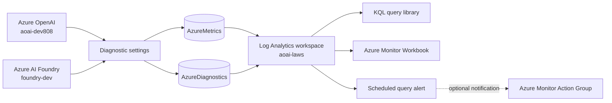

# Azure Monitoring Infrastructure

This solution monitors token usage, request activity, failures, and throttling for
Azure OpenAI and Azure AI Foundry resources. It uses Azure Monitor as the telemetry
source, Log Analytics as the shared query store, an Azure Workbook for visualization,
and a scheduled query alert for operational notification.

This document describes the resources and how they fit together. Bicep deployment
steps and manual Azure portal configuration will be added after the architecture is
reviewed.

## Solution overview

Azure OpenAI and Foundry emit platform metrics and request/response diagnostic logs.
Diagnostic settings route that telemetry to the shared Log Analytics workspace. The
KQL library, workbook, and alert then query the workspace for different purposes:
investigation, visualization, and notification.

## Resource inventory

| Resource | Provisioned by this repository | Purpose |
| --- | --- | --- |
| Azure OpenAI resource | No | Serves model requests and emits metrics and diagnostic logs. The sample target is `aoai-dev808`. |
| Azure AI Foundry resource | No | Serves Foundry model requests and emits metrics and diagnostic logs. The sample target is `foundry-dev`. |
| Log Analytics workspace | No | Stores the shared `AzureMetrics` and `AzureDiagnostics` data queried by this solution. The documented workspace is `aoai-laws`. |
| Diagnostic settings | No | Route metrics and the `RequestResponse` log category from each monitored AI resource to `aoai-laws`. |
| Azure Monitor Workbook | Yes | Provides interactive token-usage and HTTP-status charts. Defined in `infra/workbook-token-usage.bicep`. |
| Scheduled query alert | Yes | Detects HTTP 429 responses for one target resource. Defined in `infra/alert-throttling.bicep`. |
| Azure Monitor Action Group | No | Optionally receives alert notifications or invokes an automation action. |
| `PrincipalMap` Log Analytics function | No | Optionally maps caller object IDs to friendly names and teams for attribution queries. |

The Bicep files consume existing resource IDs rather than creating the Log Analytics
workspace or Action Group. Diagnostic settings also remain an external prerequisite.

## Telemetry foundation

### Azure Monitor metrics

Platform metrics are exported to the `AzureMetrics` table. They provide the token
counts used by the time-series, attribution estimate, and cost-estimate queries.
Metric availability varies by model and deployment type, so the discovery query in
the KQL library should be used to confirm names before relying on a report.

The solution currently recognizes these token metrics:

- `TokenTransaction`
- `ProcessedPromptTokens`
- `GeneratedTokens`
- `ProcessedInferenceTokens`
- `ActiveTokens`

### Diagnostic logs

The `RequestResponse` diagnostic category is exported to the `AzureDiagnostics`
table. It supplies request counts, response status, operation names, caller identity
when present, and deployment metadata when the service emits it.

Diagnostic logs do not contain token counts in this design. Per-principal token usage
is therefore an estimate that allocates daily metric totals according to each
principal's share of requests.

### Log Analytics workspace

`aoai-laws` is the central data boundary for this solution. Keeping telemetry from
both AI resources in one workspace enables shared queries and cross-service views.
Workspace retention, access control, data residency, and ingestion cost are managed
outside the current Bicep modules.

Users who run the queries or open the workbook need permission to read the workspace.
Identities that deploy the workbook and alert also need management-plane permissions
for those resource types and access to reference the workspace and Action Group.

## Workbook

`infra/workbook-token-usage.bicep` creates a shared Azure Monitor Workbook named
`AI Monitoring - AOAI & Foundry Token Usage` by default.

The workbook uses the Log Analytics workspace as its source and provides:

- A seven-day default time-range picker.
- A single-select target picker for `aoai-dev808` or `foundry-dev`.
- An hourly token-usage timechart sourced from `AzureMetrics`.
- An hourly request-status column chart sourced from `AzureDiagnostics`.

The workbook is intentionally unlocked so operators can refine it in the Azure portal.
Its target-resource list is currently embedded in the workbook definition; different
resource names require changing that definition before deployment.

## Throttling alert

`infra/alert-throttling.bicep` creates one Azure Monitor scheduled query rule for one
AI resource. The rule queries `AzureDiagnostics` for HTTP 429 responses whose
`_ResourceId` contains the configured target-resource name.

The default behavior is:

- Evaluate the previous one-hour window every hour.
- Fire at severity 2 when at least five matching 429 records are found.
- Scope the query to the supplied Log Analytics workspace.
- Notify the supplied Action Group when one is configured.

Because the module monitors one target at a time, it must be instantiated separately
for Azure OpenAI and Foundry when both services require alerts. An empty Action Group
resource ID still creates the alert, but no notification action is attached.

The alert indicates that callers are being rate limited. It is evidence to investigate
deployment throughput, quota, retry behavior, and traffic patterns; it does not resize
capacity automatically.

## KQL query library

`docs/kql-queries.md` is the investigation and reporting layer. It includes queries
for telemetry discovery, token trends, callers, estimated token attribution, daily top
consumers, throttling, model/deployment breakdown, utilization, and estimated cost.

Most queries isolate a service with a `targetResource` substring match against
`_ResourceId`. Environment placeholders must be replaced before the results are
treated as authoritative. The discovery queries should be run first because metric
and diagnostic column availability can differ between resources.

The optional `PrincipalMap` workspace function enriches object IDs with a friendly
name and team. It is maintained in Log Analytics rather than deployed by this
repository, and its contents should not include secrets.

## Required configuration boundary

For the solution to return data, the Azure environment must provide all of the
following:

1. Azure OpenAI and/or Azure AI Foundry resources that are receiving traffic.
2. A Log Analytics workspace accessible to the operators and deployment identity.
3. Diagnostic settings on every monitored AI resource that send platform metrics and
   the `RequestResponse` category to that workspace.
4. Resource names in the workbook and KQL queries that match the monitored resources.
5. An optional Action Group when alert notifications are required.
6. An optional `PrincipalMap` function when friendly caller attribution is required.

## Current limitations

- The repository does not create the workspace, diagnostic settings, Action Group,
  monitored AI resources, or `PrincipalMap` function.
- Workbook target names are hardcoded to the sample environment.
- `_ResourceId has targetResource` is a substring match; target names should be chosen
  carefully to avoid matching another resource unintentionally.
- The alert depends on 429 records reaching `AzureDiagnostics`; missing diagnostic
  settings or ingestion latency can suppress or delay detection.
- Per-principal tokens and costs are estimates, not billing-grade attribution.
- Metric names and diagnostic columns must be validated for each Azure environment.
- The current alert API version is preview and should be reassessed before production
  rollout.

## Review checkpoint

After this architecture is approved, this document will be extended with:

- Bicep deployment prerequisites, parameter files, validation, and deployment commands.
- Manual Azure portal setup for the workspace, diagnostic settings, workbook, alert,
  Action Group, permissions, and `PrincipalMap` function.
- Post-deployment validation for telemetry flow, workbook results, and alert delivery.